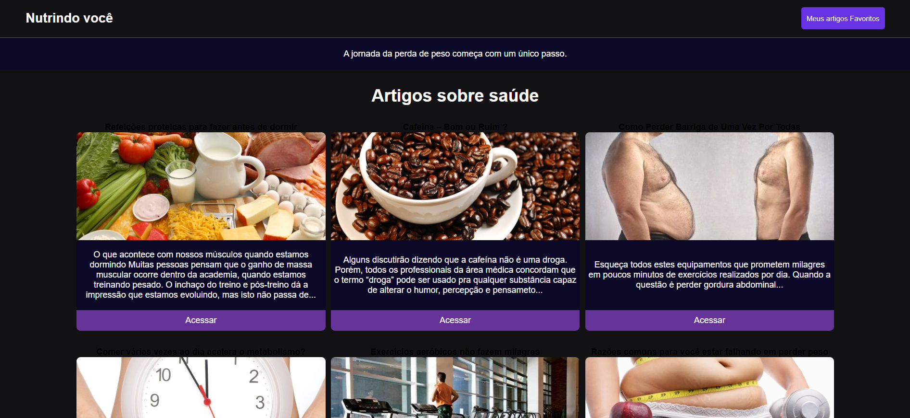

## Nutrição Você 

Aplicação que utiliza a API, que exibe informações sobre nutrição.

A aplicação é uma página web que exibe informações sobre nutrição, incluindo títulos, imagens e subtítulos de diferentes posts relacionados ao tema, vindo da API.

- Boas práticas.
- Interface intuitiva
- Responsiva
- Styled components
- Integração com API

<h1>
         
</h1>

<h1>
         
</h1>

## 🔧 Tecnologias

- Javascript
- React

Deploy: <a href="https://blog-nutri-o-api-ho6p.vercel.app/"> - Veja o projeto clique aqui </a>